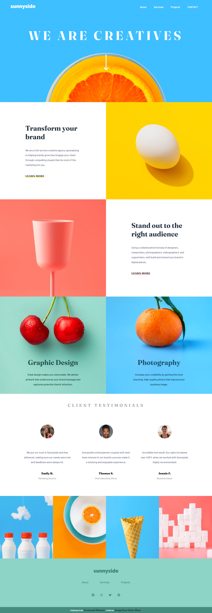

# Frontend Mentor - Intro section with dropdown navigation solution

This is a solution to the [Intro section with dropdown navigation challenge on Frontend Mentor](https://www.frontendmentor.io/challenges/intro-section-with-dropdown-navigation-ryaPetHE5). Frontend Mentor challenges help you improve your coding skills by building realistic projects. 

## Table of contents

- [Overview](#overview)
  - [The challenge](#the-challenge)
  - [Screenshot](#screenshot)
  - [Links](#links)
- [My process](#my-process)
  - [Built with](#built-with)

- [Author](#author)

## Overview

### The challenge

Users should be able to:

- View the relevant dropdown menus on desktop and mobile when interacting with the navigation links
- View the optimal layout for the content depending on their device's screen size
- See hover states for all interactive elements on the page

### Screenshot

### Links

- Solution URL:[(https://github.com/Aung-Pyae-Sone-Shan/intro-section-with-dropdown-navigation-main)](https://github.com/Aung-Pyae-Sone-Shan/sunnyside-agency-landing-page-main)
- Live Site URL:[(https://aung-pyae-sone-shan.github.io/intro-section-with-dropdown-navigation-main/)](https://aung-pyae-sone-shan.github.io/sunnyside-agency-landing-page-main/)

## My process

### Built with

- Html
- CSS 
- JavaScript

## Author

<!-- - Website - [Add your name here](https://www.your-site.com) -->
- Frontend Mentor - [@Aung-Pyae-Sone-Shan](https://www.frontendmentor.io/profile/Aung-Pyae-Sone-Shan)
- LinkedIn - [@Aung-Pyae-Sone-Shan](https://www.linkedin.com/in/aung-pyae-sone-shan/)
<!-- - Twitter - [@yourusername](https://www.twitter.com/yourusername) -->

